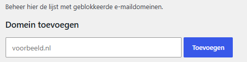
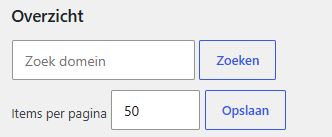
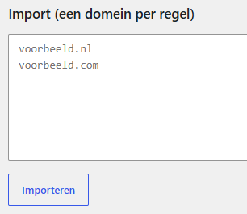
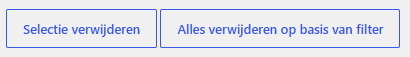
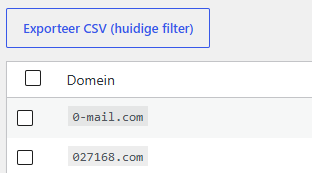
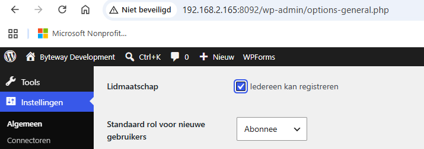
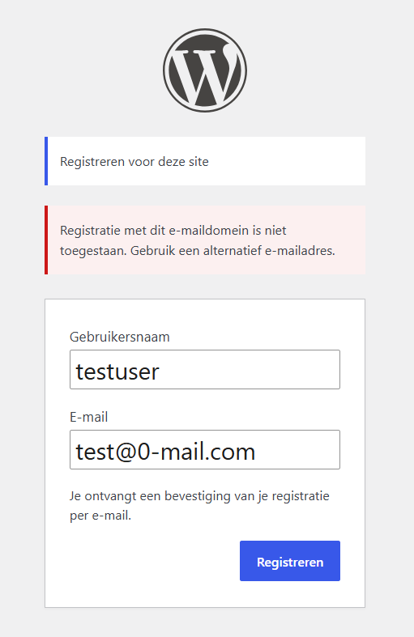

# BSO Block Email Domains

WordPress plugin voor het beheren van geblokkeerde e-maildomeinen bij registratie en profielupdates.

> **MVP / v2.0.0**
> Deze versie is functioneel gereed, handmatig E2E gevalideerd en klaar voor verdere doorontwikkeling.

## Inhoudsopgave

1. [Features](#features)
2. [Requirements](#requirements)
3. [Installation](#installation)
4. [Usage](#usage)
5. [REST API](#rest-api)
6. [Project Structure](#project-structure)
7. [MVP Status en Roadmap](#mvp-status-en-roadmap)
8. [Contributing](#contributing)
9. [License](#license)

## Features

- Blokkering van registratie met geblokkeerde e-maildomeinen
- Blokkering van profielupdates naar geblokkeerde domeinen
- Adminpagina onder Instellingen > Block Email Domains
- Domeinen toevoegen, bewerken, verwijderen en bulk verwijderen
- Zoeken, pagineren en page size instellen
- Import van domeinen via tekstinvoer
- CSV export van de huidige lijst of filterset
- Undo na verwijderacties
- Publieke uitleg via shortcode `[bso_blocked_domain_info]`

## Requirements

- WordPress met toegankelijke adminomgeving
- PHP met standaard WordPress functies
- Beheerder met capability `manage_options`

## Installation

1. Plaats de plugin in de WordPress pluginmap.
2. Activeer de plugin via Plugins in WordPress.
3. Controleer of de tabel `wp_bso_blocked_domains` is aangemaakt.
4. Open daarna Instellingen > Block Email Domains.

## Usage

### Admin

De beheerpagina staat onder **Instellingen > Block Email Domains**.

#### Domein toevoegen

Gebruik het formulier bovenaan om direct een domein toe te voegen.



#### Zoeken en filteren

De lijst ondersteunt zoeken op deelstring, zodat een beheerder snel subsets kan vinden en beheren.



#### Bulk import

Gebruik het importveld voor meerdere domeinen tegelijk. De plugin valideert regels, negeert duplicaten en verwerkt grotere imports in chunks.



#### Bulk verwijderen en undo

Je kunt een selectie verwijderen of alles verwijderen op basis van het huidige filter. Daarna is tijdelijk een undo beschikbaar.



#### CSV export

Exporteer de huidige lijst of filterset als CSV voor audit, migratie of back-up.



### Front-end

De plugin blokkeert registratie met geblokkeerde e-maildomeinen in de standaard WordPress registratieflow.

#### Registratie inschakelen in WordPress

Voor test- of productiegebruik moet publieke registratie in WordPress toegestaan zijn.



#### Registratieflow

Wanneer een bezoeker zich registreert met een geblokkeerd domein, wordt de registratie geweigerd met een duidelijke foutmelding.



#### Shortcode

Gebruik onderstaande shortcode op een publieke pagina om bezoekers vooraf te informeren:

```text
[bso_blocked_domain_info]
```

Ondersteunde attributen:

| Attribuut | Verplicht | Omschrijving |
|-----------|-----------|--------------|
| `title` | Nee | Overschrijft de standaardtitel |
| `text` | Nee | Overschrijft de standaarduitleg |
| `class` | Nee | Extra CSS-class voor de wrapper |

Voorbeeld:

```text
[bso_blocked_domain_info title="E-mailcontrole" text="Gebruik een alternatief e-mailadres als registratie wordt geweigerd."]
```

## REST API

Deze versie exposeert geen publieke REST API.

Beheeracties lopen server-side via `admin-post.php` handlers binnen de WordPress adminomgeving.

## Project Structure

```text
bso-blocked-domains/
├── admin/
│   └── class-bso-admin-page.php
├── document/
│   ├── E2E_Testplan_v2.md
│   ├── Functional_Design.md
│   ├── Handoff_Runbook_Beheerder.md
│   ├── Release_Checklist_v2.md
│   ├── Release_Notes_2.0.0.md
│   ├── Technical_Design.md
│   └── v2.md
├── image/
├── includes/
│   ├── class-bso-db.php
│   ├── class-bso-domain-service.php
│   ├── domain-validation.php
│   └── frontend-ui.php
├── legacy/
├── bso-block-domain.php
└── uninstall.php
```

## MVP Status en Roadmap

### Geimplementeerd

- [x] Datamodel met unieke domeinopslag
- [x] Admin beheer voor add, edit, delete en filter
- [x] Import van domeinlijsten
- [x] CSV export
- [x] Undo na delete
- [x] Registratieblokkering
- [x] Profielupdateblokkering
- [x] Shortcode voor publieksuitleg
- [x] Handmatig E2E gevalideerd

### Planned / Ready for development

- [ ] Import preview als aparte bevestigingsstap
- [ ] Query-optimalisatie voor grotere datasets
- [ ] Multi-row bulk inserts
- [ ] Geautomatiseerde testsuite
- [ ] Optionele audit logging

## Contributing

Gebruik een eenvoudige Git-flow:

1. Maak een branch vanaf `main`.
2. Voer wijzigingen door in kleine, toetsbare stappen.
3. Werk documentatie en testresultaten mee bij.
4. Open daarna een reviewbare wijziging of mergeflow binnen het team.

## License

GPL-2.0-or-later
