# Functioneel Ontwerp - BSO Block Email Domains

**Plugin:** `bso-blocked-domains`  
**Versie:** 1.7  
**Auteur:** Byteway Software Ontwikkeling  
**Datum:** 28 juni 2026  
**Doelplatform:** WordPress

---

## Inhoudsopgave

1. [Inleiding en doel](#1-inleiding-en-doel)
2. [Architectuuroverzicht](#2-architectuuroverzicht)
3. [Datamodel](#3-datamodel)
4. [Beheeromgeving (Admin)](#4-beheeromgeving-admin)
5. [Publieke registratieblokkering](#5-publieke-registratieblokkering)
6. [AJAX API en verwerkingsflows](#6-ajax-api-en-verwerkingsflows)
7. [Validatie- en bedrijfslogica](#7-validatie--en-bedrijfslogica)
8. [Klassen- en modulestructuur](#8-klassen--en-modulestructuur)
9. [Activatie en deinstallatie](#9-activatie-en-deinstallatie)
10. [Assets, lokalisatie en tooling](#10-assets-lokalisatie-en-tooling)
11. [Rollen, toegang en beveiliging](#11-rollen-toegang-en-beveiliging)

---

## 1. Inleiding en doel

De plugin **BSO Block Email Domains** voorkomt dat gebruikersaccounts worden aangemaakt of bijgewerkt met e-mailadressen van domeinen die op een blokkeerlijst staan.

De plugin ondersteunt:
- Blokkering bij publieke registratie
- Blokkering bij admin-profielupdates
- Beheer van geblokkeerde domeinen via admin UI
- Import/export workflows voor grote domeinlijsten

### Doelgroepen

| Rol | Doel |
|-----|------|
| Beheerder (`manage_options`) | Domeinen importeren, beheren, corrigeren, verwijderen, exporteren |
| Publieke bezoeker | Registratie wordt geweigerd bij geblokkeerd e-maildomein |
| Sitebeheer (operationeel) | Controleerbare, schaalbare en onderhoudbare domeinblokkering |

---

## 2. Architectuuroverzicht

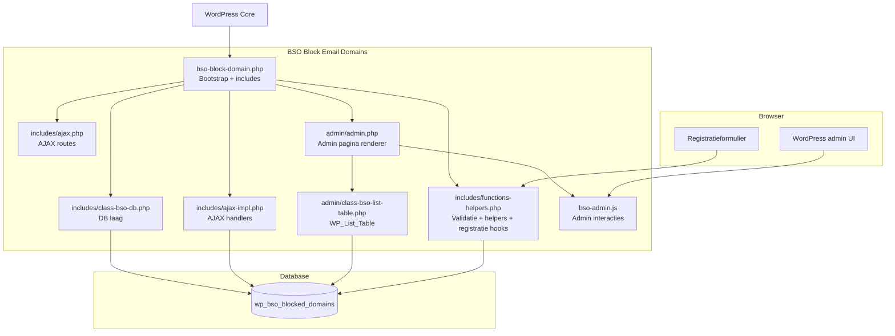

### Subfolder-dekking

Onderstaande onderdelen zijn meegenomen in dit ontwerp:
- `admin/`
- `includes/`
- `languages/`
- `vendor/`
- `tools/`
- rootbestanden (`bso-block-domain.php`, `bso-admin.js`, `uninstall.php`, `blocked-domains.txt`, `readme.md`)

---

## 3. Datamodel

De plugin gebruikt een dedicated tabel voor opslag van geblokkeerde domeinen.

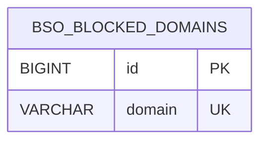

### Tabel: `wp_bso_blocked_domains`

| Veld | Type | Omschrijving |
|------|------|--------------|
| `id` | BIGINT(20) UNSIGNED | Primaire sleutel, auto-increment |
| `domain` | VARCHAR(255) | Geblokkeerd domein, uniek (`UNIQUE KEY`) |

### Datakarakteristieken

- Duplicaten worden genegeerd door `INSERT IGNORE`
- Zoek- en exportacties ondersteunen filtering via `LIKE`
- Opslag is DB-only (geen actieve file-based opslag meer)

---

## 4. Beheeromgeving (Admin)

### Menu en toegang

De plugin registreert een instellingenpagina onder:

- **Instellingen > Block Email Domains**

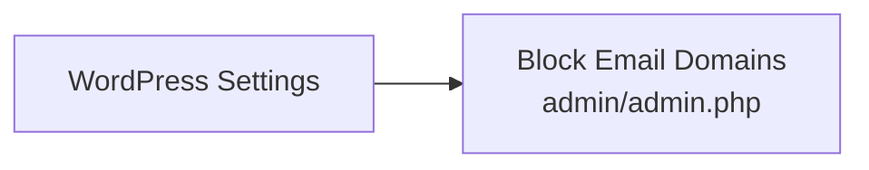

Vereiste capability: `manage_options`.

### Kernfuncties in beheerpagina

1. Importbestand uploaden en previewen
2. Import in chunks starten
3. Domein handmatig toevoegen
4. Domein per rij bewerken/verwijderen
5. Bulk delete en delete-all-matching
6. CSV export van (gefilterde) lijst

### Procesflow: import + preview

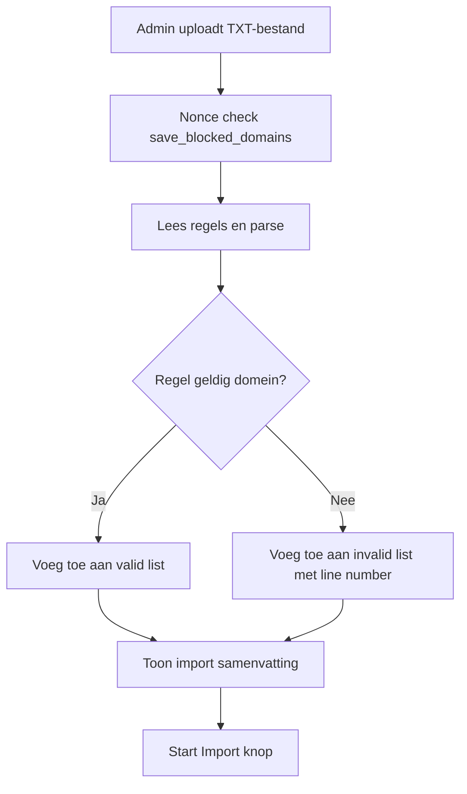

### Procesflow: lijstbeheer

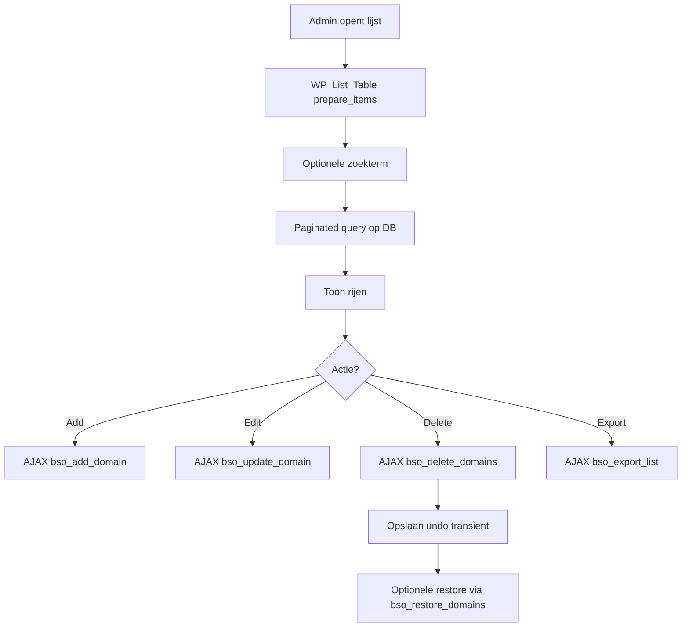

---

## 5. Publieke registratieblokkering

De plugin controleert e-maildomeinen bij registratie- en profielworkflows.

### Blokkeerpunt 1: publieke registratie

- Hook: `registration_errors`
- Controle: domein uit user e-mail vergelijken met geblokkeerde lijst
- Gedrag: foutmelding toevoegen bij match

### Blokkeerpunt 2: admin profielupdate

- Hook: `user_profile_update_errors`
- Controle identiek aan publieke registratie

### Procesflow blokkering

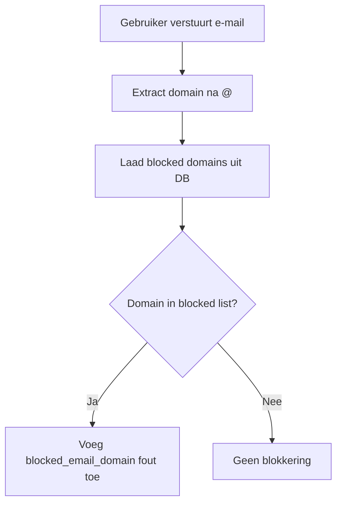

---

## 6. AJAX API en verwerkingsflows

### Beschikbare AJAX acties

| Actie | Doel |
|------|------|
| `bso_add_domain` | Domein toevoegen |
| `bso_update_domain` | Domein bewerken |
| `bso_delete_domains` | Enkele/meerdere/all-matching verwijderen |
| `bso_import_init` | Importset voorbereiden in transient |
| `bso_import_chunk` | Chunkgewijs importeren |
| `bso_export_invalid` | Invalid importregels als CSV exporteren |
| `bso_export_list` | Huidige/gefilterde domeinlijst exporteren |
| `bso_set_page_size` | Paginaformaat instellen |
| `bso_restore_domains` | Verwijderde domeinen herstellen (undo) |

### Procesflow: chunked import

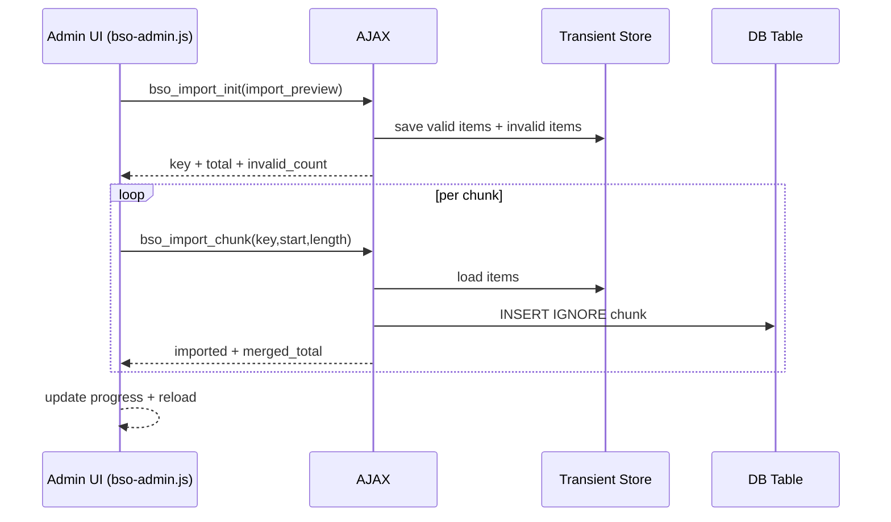

### Procesflow: delete + undo

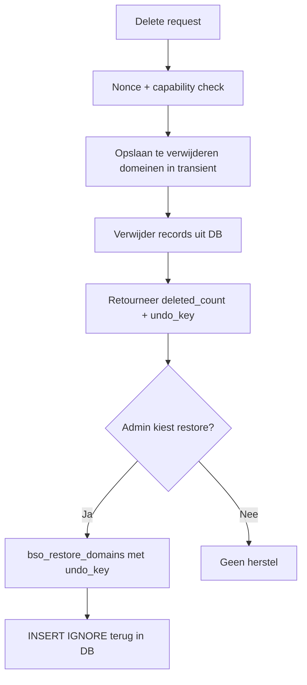

---

## 7. Validatie- en bedrijfslogica

### Domeinvalidatie

De helperlogica valideert onder andere:

- Geen spaties of `@`
- Minimaal een punt in domein
- Geen leading/trailing punt
- Maximale domeinlengte 253
- Labelregels: max 63, geen leading/trailing `-`, alleen `[A-Za-z0-9-]`

### IDN/punycode verwerking

Bij beschikbaarheid van `idn_to_ascii` wordt domein omgezet naar ASCII-variant voor validatie en opslag.

### Importregels

- Lege regels worden genegeerd
- Geldige regels worden gededupliceerd
- Ongeldige regels worden geregistreerd met regelnummer en originele waarde

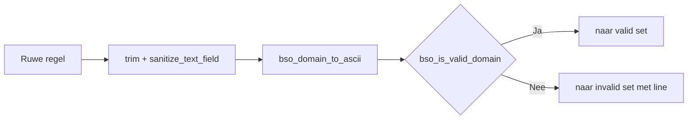

---

## 8. Klassen- en modulestructuur

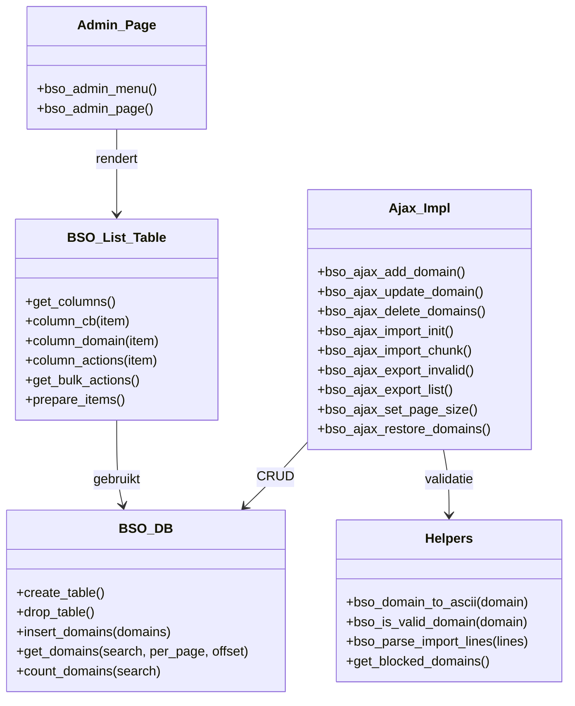

### Mapniveau (onderdelen)

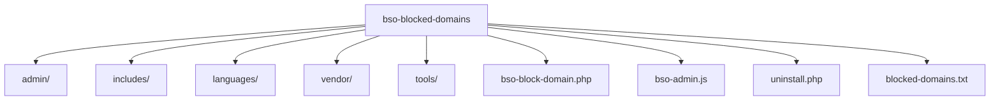

---

## 9. Activatie en deinstallatie

### Activatie

Bij pluginactivatie wordt de DB-tabel aangemaakt via `register_activation_hook` en `dbDelta`.

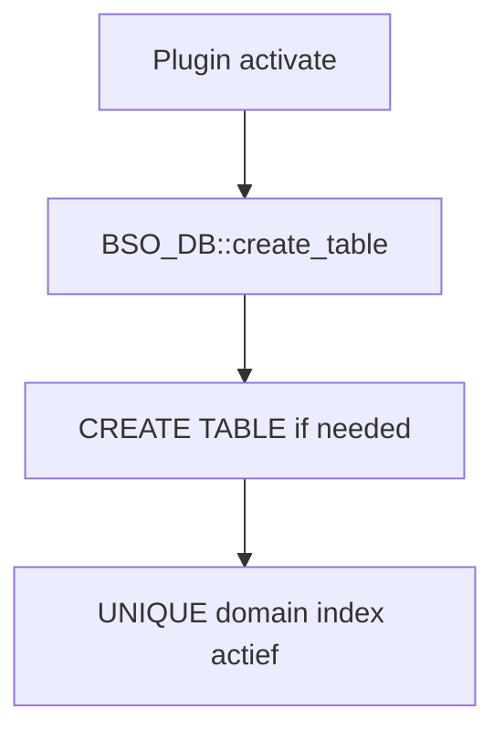

### Deinstallatie

Er zijn twee deinstallatiepaden aanwezig:

1. `uninstall.php` met `DROP TABLE IF EXISTS`
2. `register_uninstall_hook(... BSO_DB::drop_table)` in DB-module

Beide verwijderen de plugindata (destructief).

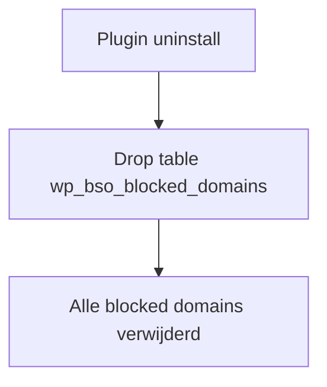

---

## 10. Assets, lokalisatie en tooling

### Assets

| Bestand | Functie |
|--------|---------|
| `bso-admin.js` | UI interactie, modal/prompt, AJAX calls, importprogress |
| `vendor/sweetalert2.min.js` | Modal dialogs en toasts |

### Lokalisatie

| Map/bestand | Doel |
|-------------|------|
| `languages/block-email-domains.pot` | Vertaaltemplate |
| `languages/nl_NL.po` | Nederlandse vertaling |

### Tooling

| Bestand | Doel |
|--------|------|
| `tools/po2mo.php` | Conversie/ondersteuning vertaalbestanden |

---

## 11. Rollen, toegang en beveiliging

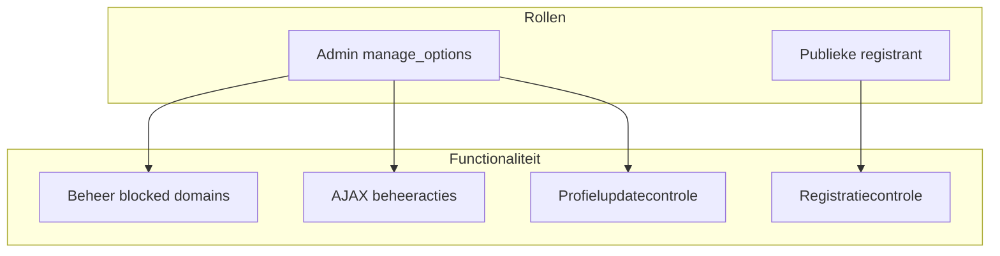

### Beveiligingsmaatregelen

- Capability checks op AJAX endpoints
- Nonce validatie op muterende acties
- Sanitization van inputvelden
- Voorbereide SQL statements waar toegepast
- Isolatie van data in dedicated tabel

### Toegangsmatrix

| Actie | Anoniem | Ingelogde gebruiker | Admin |
|------|---------|---------------------|-------|
| Registreren met geblokkeerd domein | Geblokkeerd | Geblokkeerd | n.v.t. |
| Domeinen beheren | Nee | Nee | Ja |
| Import/export uitvoeren | Nee | Nee | Ja |
| Gebruiker met geblokkeerd domein opslaan in admin | n.v.t. | n.v.t. | Geblokkeerd |

---

## Bijlage - Functionele status

De plugin is functioneel voor productiegebruik als beheerplugin voor domeinblokkering. Door de modulaire opzet (`admin/`, `includes/`, `vendor/`, `languages/`) is de codebase klaar voor doorontwikkeling, zoals extra auditlogging, uitgebreidere rapportage of role-based delegatie.

---

*Gegenereerd op 28 juni 2026 - BSO Block Email Domains v1.7*
