# Functioneel Ontwerp - BSO Block Email Domains

**Plugin:** `bso-blocked-domains`  
**Versie:** 2.0.0  
**Auteur:** Byteway Software Ontwikkeling  
**Datum:** 3 juli 2026  
**Doelplatform:** WordPress

---

## Inhoudsopgave

1. [Inleiding en doel](#1-inleiding-en-doel)
2. [Architectuuroverzicht](#2-architectuuroverzicht)
3. [Datamodel](#3-datamodel)
4. [Beheeromgeving (Admin)](#4-beheeromgeving-admin)
5. [Publieke registratieblokkering](#5-publieke-registratieblokkering)
6. [Import, export en herstel](#6-import-export-en-herstel)
7. [Validatie- en bedrijfslogica](#7-validatie--en-bedrijfslogica)
8. [Klassen- en modulestructuur](#8-klassen--en-modulestructuur)
9. [Activatie en deinstallatie](#9-activatie-en-deinstallatie)
10. [Assets, lokalisatie en tooling](#10-assets-lokalisatie-en-tooling)
11. [Rollen, toegang en beveiliging](#11-rollen-toegang-en-beveiliging)

---

## 1. Inleiding en doel

De plugin **BSO Block Email Domains** voorkomt dat gebruikersaccounts worden aangemaakt of bijgewerkt met e-mailadressen van domeinen die op een beheerde blokkeerlijst staan.

De plugin ondersteunt:

- blokkering bij publieke registratie
- blokkering bij admin-profielupdates
- beheer van geblokkeerde domeinen via WordPress admin
- import van grote domeinlijsten
- export van de huidige domeinlijst als CSV
- undo na verwijderacties
- optionele shortcode voor publieke uitleg

### Doelgroepen

| Rol | Doel |
|-----|------|
| Beheerder (`manage_options`) | Domeinen beheren, importeren, exporteren en corrigeren |
| Publieke bezoeker | Registratie wordt geweigerd bij een geblokkeerd e-maildomein |
| Sitebeheer | Betrouwbare en controleerbare beheersing van toegestane registratiedomeinen |

---

## 2. Architectuuroverzicht

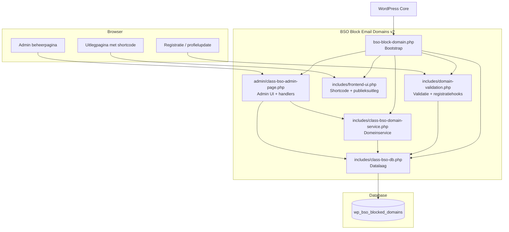

---

## 3. Datamodel

De plugin gebruikt een dedicated tabel voor opslag van geblokkeerde domeinen.

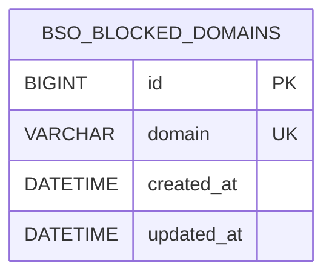

### Tabel: `wp_bso_blocked_domains`

| Veld | Type | Omschrijving |
|------|------|--------------|
| `id` | BIGINT(20) UNSIGNED | Primaire sleutel, auto-increment |
| `domain` | VARCHAR(255) | Geblokkeerd domein, uniek |
| `created_at` | DATETIME | Aanmaakmoment record |
| `updated_at` | DATETIME | Laatste wijzigingsmoment |

### Datakarakteristieken

- unieke opslag van domeinen op database-niveau
- zoeken via `LIKE`
- paging via `LIMIT/OFFSET`
- import negeert duplicaten functioneel en technisch

---

## 4. Beheeromgeving (Admin)

### Menu en toegang

De plugin registreert een instellingenpagina onder:

- **Instellingen > Block Email Domains**

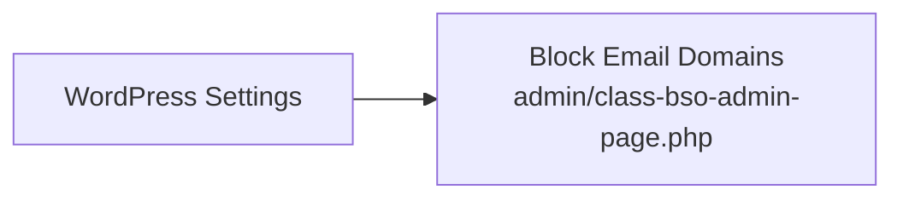

Vereiste capability: `manage_options`

### Kernfuncties in beheerpagina

1. Domein handmatig toevoegen
2. Domein bewerken
3. Selectie verwijderen
4. Alles verwijderen op basis van huidig filter
5. Undo na verwijderen
6. Zoeken en pagineren
7. Importeren via tekstveld
8. Exporteren van de huidige lijst als CSV


### Procesflow: lijstbeheer

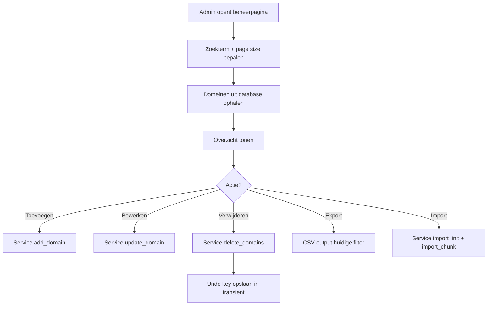

---

## 5. Publieke registratieblokkering

De plugin controleert e-maildomeinen bij registratie- en profielworkflows.

### Blokkeerpunt 1: publieke registratie

- Hook: `registration_errors`
- Controle: domein uit ingevoerd e-mailadres vergelijken met blokkeerlijst
- Gedrag: foutmelding toevoegen bij match

### Blokkeerpunt 2: admin profielupdate

- Hook: `user_profile_update_errors`
- Controle identiek aan publieke registratie

### Procesflow blokkering

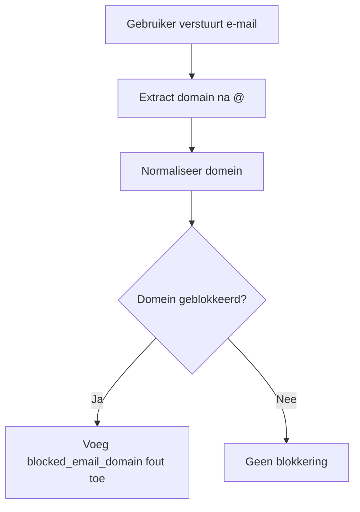

### Publieke uitleg

Voor informatie aan eindgebruikers is de shortcode beschikbaar:

```text
[bso_blocked_domain_info]
```


---

## 6. Import, export en herstel

### Import

- invoer: één domein per regel
- lege regels worden genegeerd
- ongeldige regels worden overgeslagen
- duplicaten worden niet dubbel opgeslagen
- grote imports worden chunkgewijs verwerkt

### Export

- exporteert de huidige lijst of gefilterde lijst als CSV
- output bevat minimaal kolom `domain`


### Undo

- verwijderde domeinen worden tijdelijk opgeslagen in een transient
- beheerder kan direct na verwijdering herstel uitvoeren


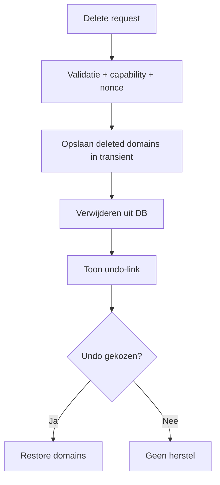

---

## 7. Validatie- en bedrijfslogica

### Domeinvalidatie

De validatielaag controleert onder andere:

- geen spaties of `@`
- minimaal één punt in domein
- geen leading of trailing punt
- maximale lengte 253 tekens
- labels maximaal 63 tekens
- labels mogen niet beginnen of eindigen met `-`
- alleen `a-z`, `0-9` en `-`

### Normalisatie

- trimmen
- lowercase
- sanitization via WordPress helpers
- IDN omzetting naar ASCII indien beschikbaar

### Importlogica

- regels worden opgesplitst per newline
- geldige regels naar `valid`
- ongeldige regels naar `invalid`
- resultaten worden gededupliceerd

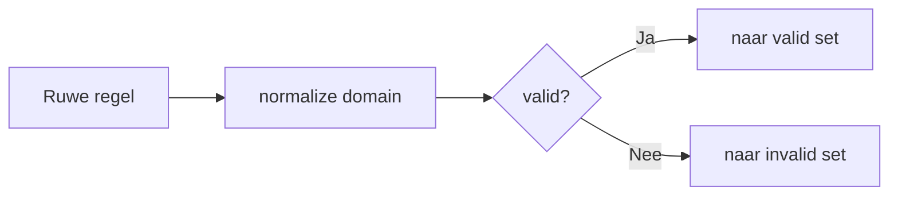

---

## 8. Klassen- en modulestructuur

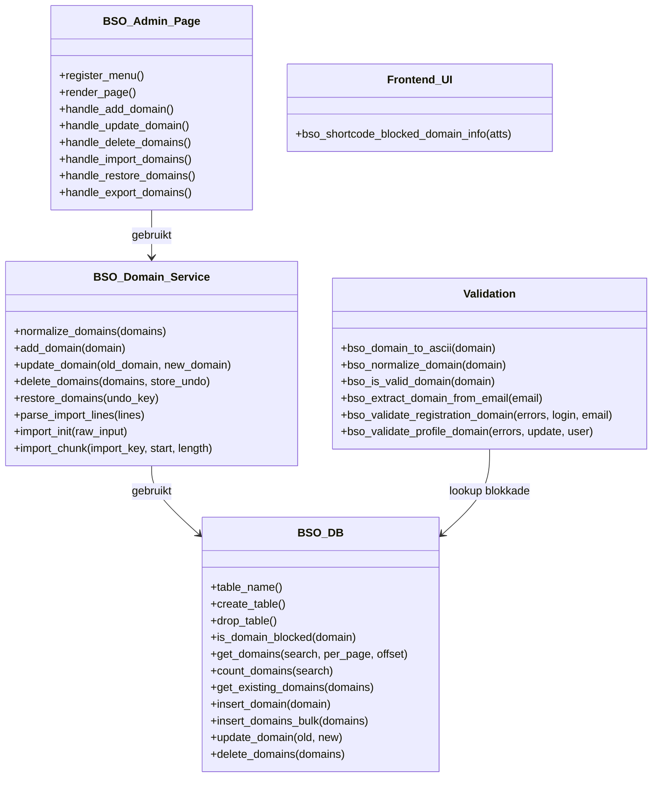

---

## 9. Activatie en deinstallatie

### Activatie

Bij activatie wordt de tabel aangemaakt via `register_activation_hook` en `dbDelta`.

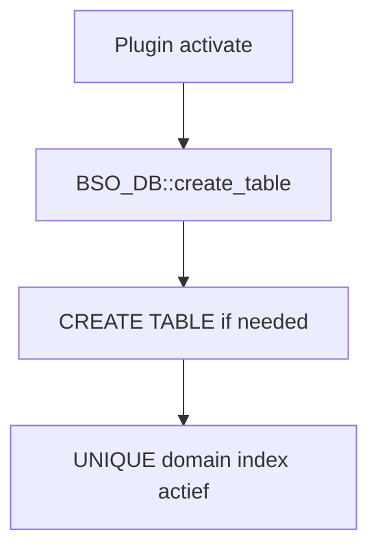

### Deinstallatie

Bij uninstall verwijdert `uninstall.php` de tabel `wp_bso_blocked_domains`.

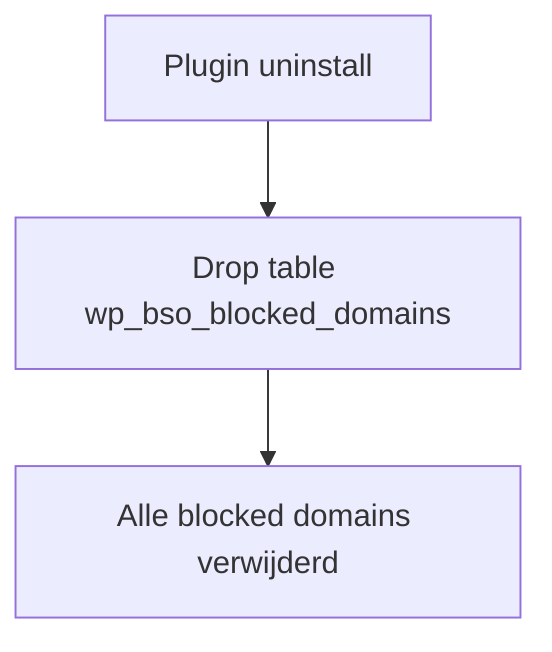

---

## 10. Assets, lokalisatie en tooling

### Assets

De v2-plugin gebruikt geen aparte JavaScript-adminbundel meer voor kernfunctionaliteit; beheeracties lopen server-side via `admin-post.php`.

### Lokalisatie

- text domain: `block-email-domains`
- laadpunt via `load_plugin_textdomain`
- foutmeldingen en beheerteksten zijn vertaalbaar

### Tooling

- releasecontrole via `document/Release_Checklist_v2.md`
- handmatige validatie via `document/E2E_Testplan_v2.md`

---

## 11. Rollen, toegang en beveiliging

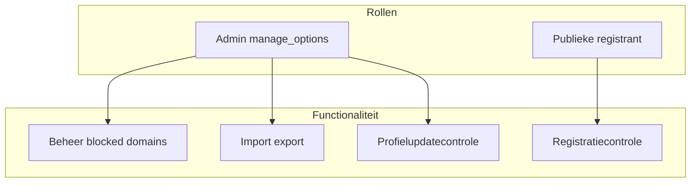

### Beveiligingsmaatregelen

- capability checks op admin-acties
- nonce-validatie op mutaties
- input sanitization op domeinen, zoekvelden en sleutels
- prepared statements in querypaden
- unieke databaseconstraint op `domain`

### Toegangsmatrix

| Actie | Anoniem | Ingelogde gebruiker | Admin |
|------|---------|---------------------|-------|
| Registreren met geblokkeerd domein | Geblokkeerd | Geblokkeerd | n.v.t. |
| Domeinen beheren | Nee | Nee | Ja |
| Import/export uitvoeren | Nee | Nee | Ja |
| Gebruiker met geblokkeerd domein opslaan in admin | n.v.t. | n.v.t. | Geblokkeerd |

---

*Gegenereerd op 3 juli 2026 - BSO Block Email Domains v2.0.0*
