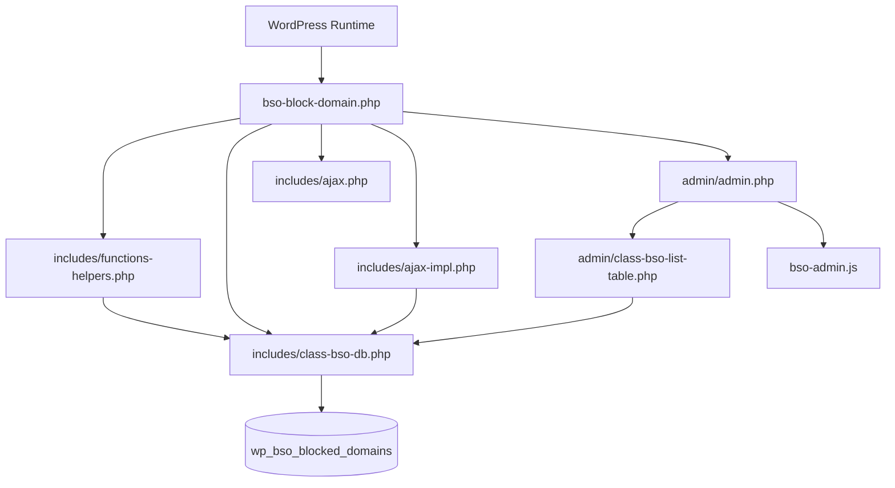
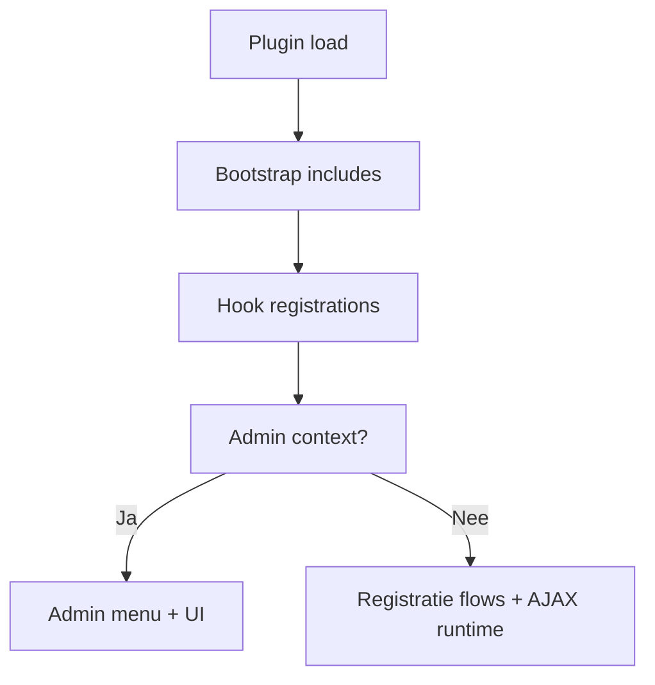
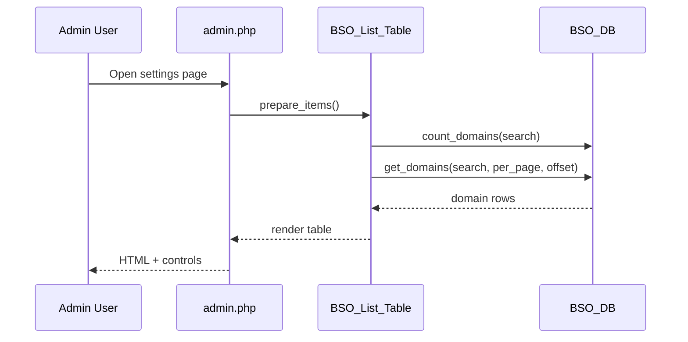
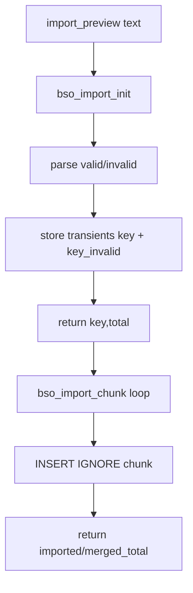
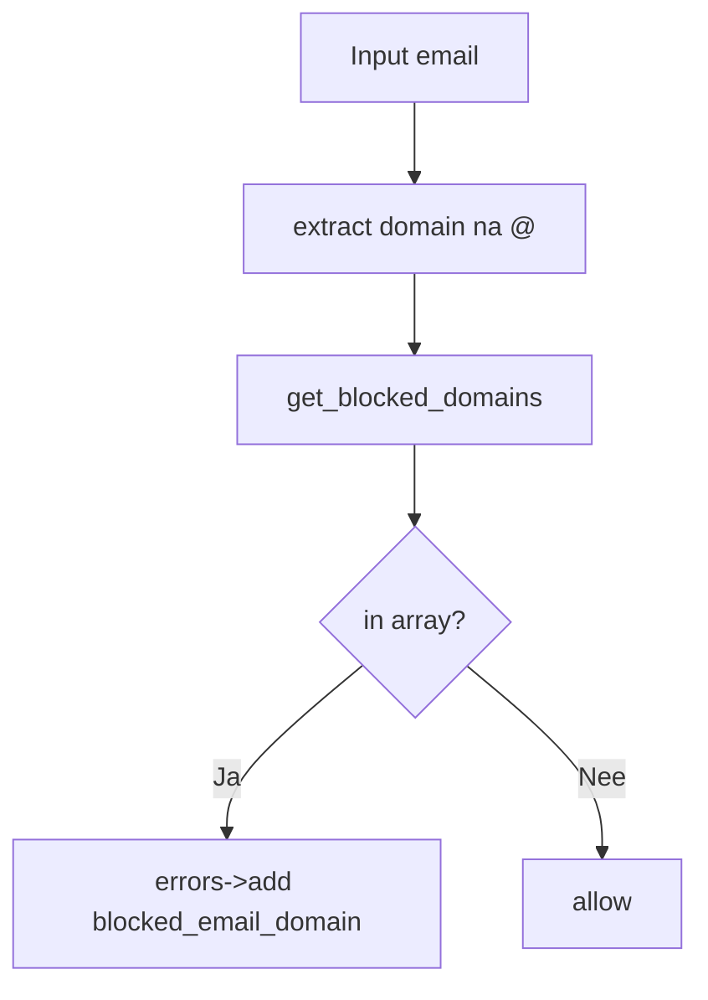

# Technisch Ontwerp - BSO Block Email Domains

**Plugin:** `bso-blocked-domains`  
**Versie:** 1.7  
**Datum:** 28 juni 2026  
**Platform:** WordPress (PHP)

---

## Inhoudsopgave

1. [Doel en scope](#1-doel-en-scope)
2. [Codebase-overzicht](#2-codebase-overzicht)
3. [Bootstrap en lifecycle](#3-bootstrap-en-lifecycle)
4. [Datalaag en SQL-ontwerp](#4-datalaag-en-sql-ontwerp)
5. [Adminarchitectuur](#5-adminarchitectuur)
6. [AJAX contracten](#6-ajax-contracten)
7. [Registratieblokkering](#7-registratieblokkering)
8. [Client-side interacties](#8-client-side-interacties)
9. [I18n, assets en distributie](#9-i18n-assets-en-distributie)
10. [Beveiliging en operationele aspecten](#10-beveiliging-en-operationele-aspecten)
11. [Known Implementation Caveats](#11-known-implementation-caveats)
12. [Refactor roadmap](#12-refactor-roadmap)

---

## 1. Doel en scope

Dit technisch ontwerp beschrijft de huidige implementatie van de plugin en is bedoeld als referentie voor:

- onderhoud en bugfixing
- functionele uitbreidingen
- technische refactor zonder regressies

Het document is gebaseerd op de actuele code in de pluginmappen `admin/`, `includes/`, `languages/`, `vendor/` en rootbestanden.

---

## 2. Codebase-overzicht

### Kernbestanden

| Bestand | Rol |
|--------|-----|
| `bso-block-domain.php` | Bootstrap, constants, includes |
| `includes/class-bso-db.php` | Datalaag en schema lifecycle |
| `includes/functions-helpers.php` | Validatie, normalisatie, hook helpers |
| `includes/ajax.php` | AJAX route registratie |
| `includes/ajax-impl.php` | AJAX handlers |
| `admin/admin.php` | Admin pagina rendering en formulierlogica |
| `admin/class-bso-list-table.php` | Lijstweergave met paginatie en acties |
| `bso-admin.js` | Client-side UI/AJAX gedragingen |
| `uninstall.php` | Destructieve uninstall cleanup |

### Hoog-over architectuur



---

## 3. Bootstrap en lifecycle

### Bootstrap

In `bso-block-domain.php`:

- WordPress guard: `if (!defined('ABSPATH')) exit;`
- constants:
	- `BSO_PLUGIN_DIR`
	- `BSO_PLUGIN_URL`
	- `BSO_PLUGIN_FILE`
- include-volgorde:
	1. `includes/functions-helpers.php`
	2. `includes/class-bso-db.php`
	3. `includes/ajax.php`
	4. `includes/ajax-impl.php`
- admin-only includes:
	- `admin/class-bso-list-table.php`
	- `admin/admin.php`

### Lifecycle hooks

`includes/class-bso-db.php` registreert:

- `register_activation_hook(..., ['BSO_DB','create_table'])`
- `register_uninstall_hook(..., ['BSO_DB','drop_table'])`

Daarnaast bestaat ook `uninstall.php` met een `DROP TABLE` pad.



---

## 4. Datalaag en SQL-ontwerp

### Tabelschema

`BSO_DB::create_table()` maakt tabel `{prefix}bso_blocked_domains`:

```sql
CREATE TABLE {prefix}bso_blocked_domains (
	id BIGINT(20) UNSIGNED NOT NULL AUTO_INCREMENT,
	domain VARCHAR(255) NOT NULL,
	PRIMARY KEY (id),
	UNIQUE KEY domain_unique (domain)
)
```

### BSO_DB API

| Methode | Gedrag |
|---------|--------|
| `create_table()` | Tabel aanmaken/updaten via `dbDelta` |
| `drop_table()` | Tabel verwijderen |
| `insert_domains(array)` | `INSERT IGNORE` per domein |
| `get_domains(search, per_page, offset)` | Domeinen ophalen, optioneel gefilterd en gepagineerd |
| `count_domains(search)` | Aantal records (optioneel op zoekfilter) |

### Query-eigenschappen

- Uniqueness is database-afgedwongen
- Zoekfilter gebruikt `LIKE %term%`
- Paging met `LIMIT/OFFSET`
- `INSERT IGNORE` voorkomt duplicate insert-fouten

---

## 5. Adminarchitectuur

### Menu en pagina

`admin/admin.php` registreert:

- `add_options_page(...)` onder Settings
- pagina callback: `bso_admin_page()`

In `bso_admin_page()`:

- capability-check `manage_options`
- enqueuen SweetAlert2 en `bso-admin.js`
- localizen `bsoAdmin` object met AJAX URL + nonces + UI strings
- upload/preview flow voor importbestand
- rendering van `BSO_List_Table`

### Lijstlaag

`admin/class-bso-list-table.php`:

- kolommen: checkbox, domain, actions
- row actions: edit/delete knoppen met `data-domain`
- paginatie op basis van optie `bso_page_size` (default 50)
- data ophalen via `BSO_DB::get_domains()`



---

## 6. AJAX contracten

### Actie-overzicht

| Action | Method | Belangrijkste input | Output |
|--------|--------|---------------------|--------|
| `bso_add_domain` | POST | `domain`, `nonce` | inserted flag + genormaliseerd domein |
| `bso_update_domain` | POST | `old`, `new`, `nonce` | aangepast domein |
| `bso_delete_domains` | POST | `domains[]` of `delete_all`, `search` | `deleted_count`, `undo_key` |
| `bso_import_init` | POST | `import_preview`, `nonce_save` | transient key + totals |
| `bso_import_chunk` | POST | `key`, `start`, `length` | incremental imported + merged total |
| `bso_export_invalid` | GET/POST | `nonce_save`, `key` of `invalid_preview` | CSV stream |
| `bso_export_list` | GET | `nonce_manage`, optionele `search` | CSV stream |
| `bso_set_page_size` | POST | `size`, `nonce_manage` | opgeslagen page size |
| `bso_restore_domains` | POST | `key`, `nonce_manage` | restored count |

### AuthN/AuthZ patroon

Elke handler valideert:

1. `current_user_can('manage_options')`
2. nonce (`bso_manage_domains` of `save_blocked_domains`, afhankelijk van actie)

### Import verwerking



### Undo mechanisme

- Bij delete wordt transient `bso_deleted_<key>` gezet (TTL 60 sec)
- Restore herplaatst records via `BSO_DB::insert_domains`

---

## 7. Registratieblokkering

### Functioneel gedrag

De plugin blokkeert:

- nieuwe accountregistratie met geblokkeerd domein
- admin profielwijziging naar geblokkeerd domein

### Technische flow



### Relevante hooks

- `registration_errors`
- `user_profile_update_errors`

---

## 8. Client-side interacties

`bso-admin.js` implementeert:

- add/edit/delete acties met fetch naar `admin-ajax.php`
- bulk delete met optional all-matching mode
- import init + chunkloop met voortgang
- restore flow via undo key
- modal/prompt/confirm abstractie met SweetAlert2 fallback naar browser dialogs

### Frontend state object

Vanuit PHP wordt `window.bsoAdmin` gevuld met:

- `ajax_url`
- `nonce_manage`
- `nonce_save`
- vertaalde UI strings

---

## 9. I18n, assets en distributie

### I18n

- text domain: `block-email-domains`
- laadpunt via `load_plugin_textdomain`
- bestanden:
	- `languages/block-email-domains.pot`
	- `languages/nl_NL.po`

### Assets

- `vendor/sweetalert2.min.js` (lokaal gebundeld)
- `bso-admin.js` (admin gedrag)

### Tooling

- `tools/po2mo.php` voor vertaalworkflow ondersteuning

---

## 10. Beveiliging en operationele aspecten

### Positief

- capability checks op beheeracties
- nonce controles op mutaties
- input sanitization met WordPress helpers
- DB uniqueness guard

### Operationeel

- chunked import voorkomt timeouts bij grotere lijsten
- transient-based undo is snel maar kortlevend
- CSV export gebruikt directe output streams

---

## 11. Known Implementation Caveats

### 11.1 Hooks in helpersbestand staan in functieblok

In `includes/functions-helpers.php` staan de functies en hook-registraties voor registratieblokkering tekstueel binnen het blok van `bso_domain_to_ascii()` (tussen de IDN-logica en de afsluitende return). Dit maakt de hookregistratie afhankelijk van runtime-uitvoering van die functie, wat functioneel onbetrouwbaar is.

Impact:

- blokkering kan niet altijd vroeg/consistent geactiveerd worden
- code leesbaarheid en onderhoudbaarheid nemen af

### 11.2 Dubbele AJAX add_action registraties

`includes/ajax.php` registreert acties, maar `includes/ajax-impl.php` registreert ten minste 3 acties opnieuw (`bso_add_domain`, `bso_update_domain`, `bso_delete_domains`).

Impact:

- onnodige duplicatie
- risico op side effects bij toekomstige wijzigingen

### 11.3 Twee uninstall-mechanismen

Er is zowel een `register_uninstall_hook(... BSO_DB::drop_table)` als een `uninstall.php` met `DROP TABLE`.

Impact:

- dubbel beheerpad
- onderhoudsrisico bij afwijkende toekomstige logica

### 11.4 Zoekveld mismatch in bulk-delete JS

`bso-admin.js` zoekt bij delete-all-matching op `input[name="bso_search"]`, terwijl de admin zoekinput `name="s"` gebruikt.

Impact:

- search-filter kan leeg doorgegeven worden bij delete-all-matching

### 11.5 admin_enqueue placeholder

`bso_admin_enqueue()` bevat alleen `get_current_screen()` zonder conditionele enqueue-logica.

Impact:

- weinig functioneel effect; potentieel verwarrend voor onderhoud

---

## 12. Refactor roadmap

### Fase 1 - Stabiliseren

1. Verplaats registratiehooks uit het `bso_domain_to_ascii` blok naar top-level in helpers.
2. Centraliseer AJAX `add_action` declaraties in 1 bestand.
3. Kies 1 uninstall-strategie (voorkeur: `uninstall.php`).
4. Fix zoekveldnaam in `bso-admin.js` (`s` in plaats van `bso_search`).

### Fase 2 - Hardening

1. Voeg nonce-check wrappers toe voor consistente foutresponsen.
2. Voeg logging/telemetrie toe rond import en mass-delete.
3. Voeg automatische tests toe voor validatie en import parser.

### Fase 3 - Schaalbaarheid

1. Batch insert optimaliseren (multi-row insert) in plaats van per-row loop.
2. Optionele cachelaag voor blocked domain set tijdens registratiepieken.

---

## Code referenties

- `bso-block-domain.php`
- `includes/class-bso-db.php`
- `admin/admin.php`
- `admin/class-bso-list-table.php`
- `includes/ajax.php`
- `includes/ajax-impl.php`
- `includes/functions-helpers.php`
- `bso-admin.js`

---

*Gegenereerd op 28 juni 2026 - Technisch Ontwerp v1.7*
