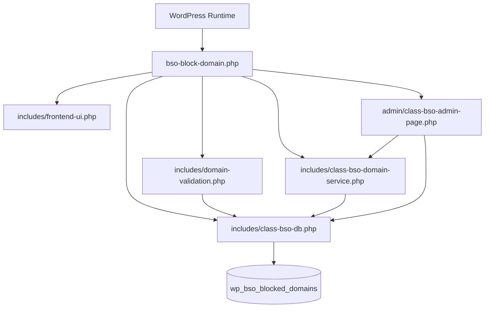
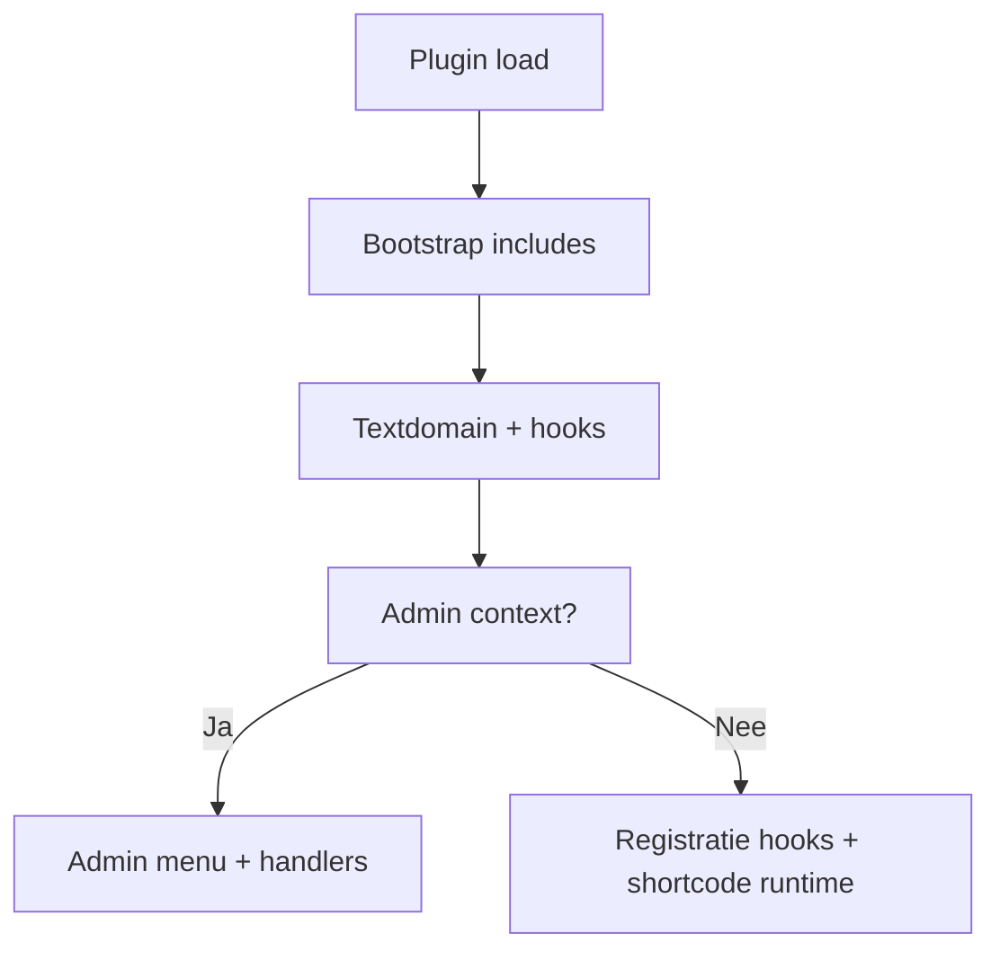
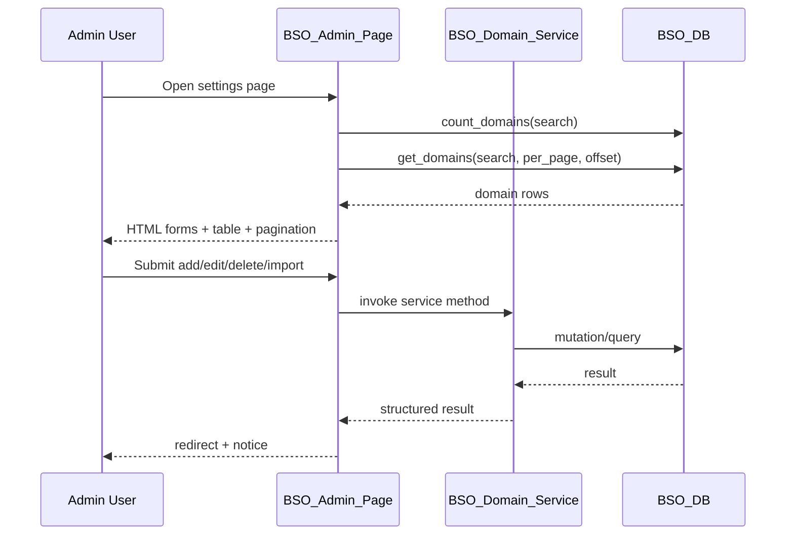
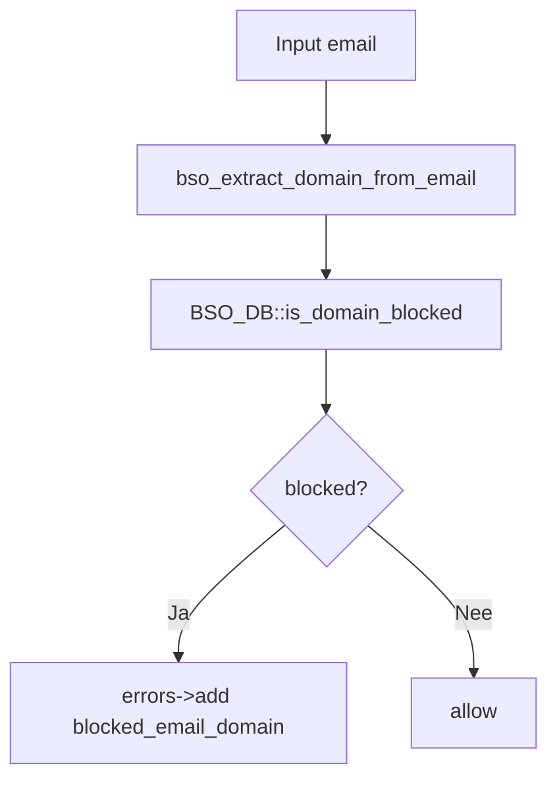

# Technisch Ontwerp - BSO Block Email Domains

**Plugin:** `bso-blocked-domains`  
**Versie:** 2.0.0  
**Datum:** 3 juli 2026  
**Platform:** WordPress (PHP)

---

## Inhoudsopgave

1. [Doel en scope](#1-doel-en-scope)
2. [Codebase-overzicht](#2-codebase-overzicht)
3. [Bootstrap en lifecycle](#3-bootstrap-en-lifecycle)
4. [Datalaag en SQL-ontwerp](#4-datalaag-en-sql-ontwerp)
5. [Adminarchitectuur](#5-adminarchitectuur)
6. [Service- en validatielaag](#6-service--en-validatielaag)
7. [Registratieblokkering](#7-registratieblokkering)
8. [Front-end componenten](#8-front-end-componenten)
9. [I18n, distributie en operationeel gebruik](#9-i18n-distributie-en-operationeel-gebruik)
10. [Beveiliging en operationele aspecten](#10-beveiliging-en-operationele-aspecten)
11. [Known Implementation Caveats](#11-known-implementation-caveats)
12. [Roadmap](#12-roadmap)

---

## 1. Doel en scope

Dit technisch ontwerp beschrijft de actuele v2-implementatie van de plugin en dient als referentie voor:

- onderhoud en bugfixing
- functionele uitbreidingen
- overdracht naar beheer of doorontwikkeling

Het document is gebaseerd op de actuele code in:

- `admin/`
- `includes/`
- rootbestanden `bso-block-domain.php` en `uninstall.php`

---

## 2. Codebase-overzicht

### Kernbestanden

| Bestand | Rol |
|--------|-----|
| `bso-block-domain.php` | Bootstrap, include-volgorde, textdomain, activation hook |
| `includes/class-bso-db.php` | Datalaag en schema lifecycle |
| `includes/domain-validation.php` | Domeinvalidatie, normalisatie en registratiehooks |
| `includes/class-bso-domain-service.php` | Centrale servicelaag voor add/update/delete/import/undo |
| `includes/frontend-ui.php` | Shortcode voor publieksuitleg |
| `admin/class-bso-admin-page.php` | Adminpagina, forms, handlers en CSV export |
| `uninstall.php` | Destructieve uninstall cleanup |

### Hoog-over architectuur



---

## 3. Bootstrap en lifecycle

### Bootstrap

In `bso-block-domain.php`:

- WordPress guard: `if (!defined('ABSPATH')) exit;`
- constants:
  - `BSO_PLUGIN_DIR`
  - `BSO_PLUGIN_FILE`
  - `BSO_PLUGIN_VERSION`
- include-volgorde:
  1. `includes/class-bso-db.php`
  2. `includes/domain-validation.php`
  3. `includes/class-bso-domain-service.php`
  4. `includes/frontend-ui.php`
  5. `admin/class-bso-admin-page.php` alleen in admin-context
- i18n hook via `plugins_loaded`

### Lifecycle hooks

- `register_activation_hook(BSO_PLUGIN_FILE, ['BSO_DB', 'create_table'])`
- uninstall via `uninstall.php`



---

## 4. Datalaag en SQL-ontwerp

### Tabelschema

`BSO_DB::create_table()` maakt tabel `{prefix}bso_blocked_domains`:

```sql
CREATE TABLE {prefix}bso_blocked_domains (
	id BIGINT(20) UNSIGNED NOT NULL AUTO_INCREMENT,
	domain VARCHAR(255) NOT NULL,
	created_at DATETIME NOT NULL DEFAULT CURRENT_TIMESTAMP,
	updated_at DATETIME NOT NULL DEFAULT CURRENT_TIMESTAMP ON UPDATE CURRENT_TIMESTAMP,
	PRIMARY KEY (id),
	UNIQUE KEY domain_unique (domain)
)
```

### BSO_DB API

| Methode | Gedrag |
|---------|--------|
| `table_name()` | Volledige tabelnaam bepalen |
| `create_table()` | Tabel aanmaken/updaten via `dbDelta` |
| `drop_table()` | Tabel verwijderen |
| `is_domain_blocked(domain)` | Bestaan van domein controleren |
| `get_domains(search, per_page, offset)` | Domeinen ophalen, optioneel gefilterd/gepagineerd |
| `count_domains(search)` | Aantal records tellen |
| `get_existing_domains(domains)` | Subset van bestaande domeinen ophalen |
| `insert_domain(domain)` | Enkel domein opslaan via `INSERT IGNORE` |
| `insert_domains_bulk(domains)` | Meerdere inserts in loop |
| `update_domain(old, new)` | Domein muteren |
| `delete_domains(domains)` | Set domeinen verwijderen |

### Query-eigenschappen

- uniqueness is database-afgedwongen
- zoekfilter gebruikt `LIKE %term%`
- paging met `LIMIT/OFFSET`
- mutaties gebruiken prepared statements

---

## 5. Adminarchitectuur

### Menu en pagina

`admin/class-bso-admin-page.php` registreert:

- `add_options_page(...)` onder Settings
- page slug: `bso-blocked-domains`

### Verwerkingsmodel

De adminpagina werkt server-side via `admin-post.php` handlers in plaats van AJAX.

Geregistreerde acties:

- `bso_add_domain`
- `bso_update_domain`
- `bso_delete_domains`
- `bso_import_domains`
- `bso_set_page_size`
- `bso_restore_domains`
- `bso_export_domains`

### Pagina-opbouw

- notice rendering
- add form
- optioneel edit form
- import form
- zoek- en page-size controls
- datatabel
- paginatie




---

## 6. Service- en validatielaag

### BSO_Domain_Service

De servicelaag centraliseert businesslogica en uniformiseert resultaten via:

```php
array(
  'ok' => bool,
  'code' => string,
  'message' => string,
  'data' => array,
)
```

### Beschikbare service-acties

| Methode | Doel |
|---------|------|
| `normalize_domains()` | Bulk normaliseren + invalid verzamelen |
| `add_domain()` | Enkel domein toevoegen |
| `update_domain()` | Domein aanpassen |
| `delete_domains()` | Domeinen verwijderen + optioneel undo |
| `restore_domains()` | Verwijderde set terugplaatsen |
| `parse_import_lines()` | Valid/invalid resultset opbouwen |
| `import_init()` | Importdataset in transient bewaren |
| `import_chunk()` | Import in batches verwerken |

### Importverwerking

```mermaid
flowchart TD
	A[raw_input] --> B[preg_split lines]
	B --> C[parse_import_lines]
	C --> D[save valid/invalid in transient]
	D --> E[return import key]
	E --> F[import_chunk(start,length)]
	F --> G[insert_domains_bulk(chunk)]
	G --> H[return processed/inserted/done]
```


### Undo-mechanisme

- transient sleutel: `bso_deleted_<key>`
- TTL: 300 seconden

### Validatielaag

`includes/domain-validation.php` verzorgt:

- IDN naar ASCII omzetting
- domeinnormalisatie
- domeinvalidatie
- e-maildomeinextractie
- centrale foutmelding via filter `bso_blocked_domain_error_message`

---

## 7. Registratieblokkering

### Functioneel gedrag

De plugin blokkeert:

- nieuwe accountregistratie met geblokkeerd domein
- admin profielwijziging naar geblokkeerd domein

### Relevante hooks

- `registration_errors`
- `user_profile_update_errors`

### Technische flow



---

## 8. Front-end componenten

### Shortcode

`includes/frontend-ui.php` registreert:

- shortcode: `bso_blocked_domain_info`

Ondersteunde attributen:

- `title`
- `text`
- `class`


### Outputgedrag

- standaardtitel en standaardtekst zijn vertaalbaar
- extra CSS-class kan meegegeven worden
- output is een eenvoudige `<section>` met titel en toelichting

---

## 9. I18n, distributie en operationeel gebruik

### I18n

- text domain: `block-email-domains`
- laadpunt via `load_plugin_textdomain`
- foutmeldingen en UI-teksten gebruiken `__()`

### Distributie

De v2-plugin is getest via handmatige E2E-suites A t/m E en heeft release-status GO.

### Operationeel gebruik

- beheer via Settings-pagina
- registratie via standaard WordPress flows
- documentatie via `document/E2E_Testplan_v2.md`, `document/Release_Checklist_v2.md` en `document/Handoff_Runbook_Beheerder.md`

---

## 10. Beveiliging en operationele aspecten

### Positief

- capability checks op beheeracties
- nonce controles op mutaties
- input sanitization met WordPress helpers
- DB uniqueness guard
- prepared statements voor querypaden

### Operationeel

- chunked import voorkomt timeouts bij grotere lijsten
- transient-based undo is kortlevend maar snel
- CSV export gebruikt directe output streams
- admin flow werkt zonder afhankelijkheid van custom JS runtime


---

## 11. Known Implementation Caveats

### 11.1 Import preview ontbreekt nog als aparte tussenstap

De huidige importflow valideert en importeert direct. Er is nog geen aparte visuele previewfase voordat de beheerder de definitieve import bevestigt.

Impact:

- functioneel werkend, maar minder controle vooraf

### 11.2 Bulk insert is nog loop-gebaseerd

`insert_domains_bulk()` voert inserts sequentieel uit via `insert_domain()`.

Impact:

- correct gedrag
- minder performant dan een multi-row insert bij zeer grote datasets

### 11.3 Geen geautomatiseerde testsuite in repository

Validatie is nu handmatig uitgevoerd via E2E-documentatie.

Impact:

- hogere afhankelijkheid van handmatige regressietests

---

## 12. Roadmap

### Korte termijn

1. Import preview toevoegen met valid/invalid split in admin UI.
2. Zoek- en paginatiequeries verder optimaliseren.
3. Edge-case testset voor IDN en malformed domeinen uitbreiden.

### Middellange termijn

1. Multi-row insert voor bulkimport implementeren.
2. Geautomatiseerde tests toevoegen voor validatie en servicegedrag.
3. Optionele audit logging toevoegen voor beheeracties.

---

*Gegenereerd op 3 juli 2026 - Technisch Ontwerp v2.0.0*
